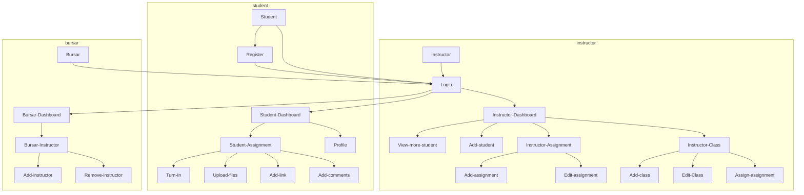

This project is still under development

## Project Presentation
https://docs.google.com/presentation/d/1dzw-Ac4YdqpA1DPqyT51CJ1cJouLfDsJhO5-TkNjLbg/edit?usp=sharing

## Project Live Preview
https://inc.methsara.tech/

## Current Progress
_Dictonary:_
> **✓** : Completed | **✕** : Not Started | **UD** : Under Development | **-** : Not Applicable
> Prot: Prototype | UI : User Interface | DB : Data Base / Backend | Integration: Integration of user interface with data base and other backend components

| Feature | Prot. | UI | DB | Integration |
|----------------------------|-------|----|----|-------------|
|Home Page|✓|✓|-|-|
|Informational Pages|✓|✓|-|-|
|Student Signup|✓|✓|✓|✓|
|Student Login|✓|✓|✓|✓|
|Student Dashboard|✓|✓|✓|✓|
|Instructor Login|✓|✓|✓|✓|
|Instructor Dashboard|✓|✓|✓|✓|
|Chairperson Login|UD|✕|✕|✕|
|Chairperson Dashboard|UD|✕|✕|✕|
|Performance Monitor Login|UD|✕|✕|✕|
|Performance Monitor Dashboard|UD|✕|✕|✕|
|Bursar Login|UD|✕|✕|✕|
|Bursar Dashboard|UD|✕|✕|✕|
|AI Chatbot - General|-|✓|-|-|
|AI Chatbot - Advanced|-|✕|✕|✕|
|Email Notification System|✕|✕|✕|✕|

## Login Roles
|Role|ID|Code|
|-----|:-----:|:----|
|Bursar|0|rep|
|Instructor|1|ins|
|Student|2|stu|

## External Libraries and Extensions
Quill JS Rich Text Editor Version 2.0.0-rc.2 - https://quilljs.com/ .\
IBM watsonx Assistant Lite

## Page Flow

